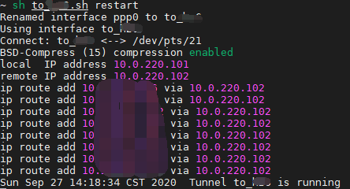

## About

Establish a ppp tunnel over ssh, easy for client residing at the intranet.


## Requirement

For create a ppp interface, **sudo** **privilege without password** required on both server and client.


## Use

Fill the ''#auth' block in the script.

```bash
sh ./ppp_over_ssh.sh start
```


## Example

#### ppp over ssh



#### ssh forward


